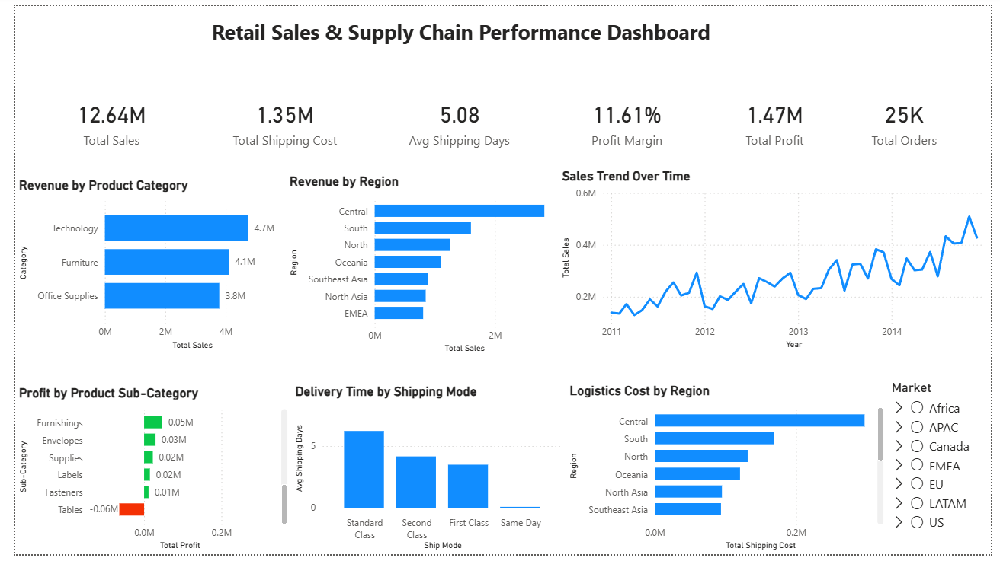

# Retail Sales & Supply Chain Performance Dashboard

## 📊 Project Overview
This project analyzes global retail sales data to understand product performance, regional sales, and supply chain efficiency.

## 🔧 Tools Used
- Power BI
- Python (Pandas)
- Data Visualization

## 📈 Key Features
- KPI tracking (Revenue, Profit, Orders, Delivery Time)
- Product profitability analysis
- Regional sales performance
- Shipping and logistics analysis

## 💡 Key Insights
- Technology category generates highest revenue
- Some sub-categories show consistent losses
- Central region contributes highest sales
- Standard Class shipping has longest delivery time

## 📷 Dashboard Preview

